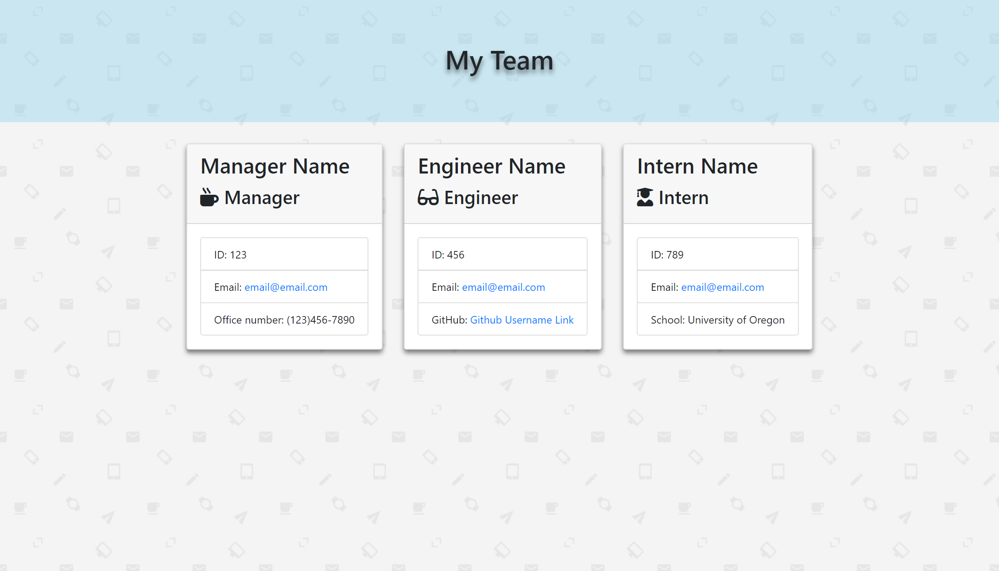

# Template Engine Employee Summary

## Description

This is a CLI app that takes in employee informaton and outputs a generated HTML file displaying said information. This project uses javascript classes and HTML templates to construct the info fields.

## Table of Contents

 * [Installation](#installation)

 * [Usage](#usage)

 * [Screenshots](#screenshots)

 * [Tests](#tests)

 * [Authors](#authors)

 * [Questions](#questions)

## Installation

Clone the repo into a folder, install the dependancies with 
```
npm i
``` 
invoke the CLI prompts with 
```
node app.js
```

When done answering questions, the generated HTML will go into the "Output" folder named "team.html".

## Usage

This is a demonstration of using automated code and templates 

## Screenshots



## Tests 

To run tests: 
 
    ``` 
    npm test 
    ``` 

## Authors


## Questions

If you have any questions about the repo, open an issue or contact me directly at heyitsbo91@gmail.com. You can find more of my work at [KeithBillings](https://github.com/KeithBillings/)